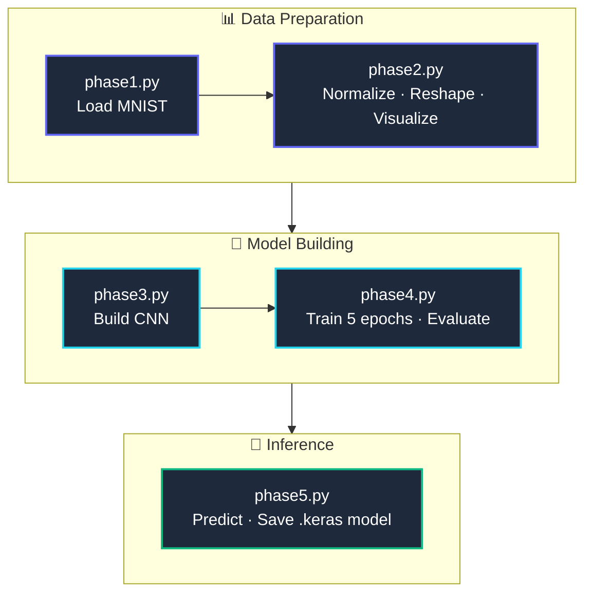

<p align="center">
  
</p>

<p align="center">
  
  
  
  
  
</p>

# Handwritten Character Recognition MVP

A Convolutional Neural Network (CNN) built to recognize handwritten digits (0-9) from the MNIST dataset.
This project was developed as **Task 3** for the **CodeAlpha Machine Learning Internship**.

## 🚀 Project Overview

The objective of this project is to build a Minimum Viable Product (MVP) capable of classifying handwritten characters with high accuracy.

The model was trained on the classic [MNIST dataset](http://yann.lecun.com/exdb/mnist/) and achieves a **98.75% Test Accuracy** in just 5 training epochs.


## 🔄 Project Workflow



## 🛠️ Tech Stack

| Component | Tool |
|---|---|
| Language | Python 3.x |
| Deep Learning Framework | TensorFlow / Keras |
| Data Manipulation | NumPy |
| Data Visualization | Matplotlib |


## 🧠 Model Architecture

The core of this project is a Sequential Convolutional Neural Network designed to process spatial hierarchies:

```mermaid
graph LR
    I(("28×28×1")) --> C1["Conv2D 32<br/>3×3 · ReLU"]
    C1 --> P1["MaxPool<br/>2×2"]
    P1 --> C2["Conv2D 64<br/>3×3 · ReLU"]
    C2 --> P2["MaxPool<br/>2×2"]
    P2 --> F["Flatten"]
    F --> D1["Dense 64<br/>ReLU"]
    D1 --> D2["Dense 10<br/>Softmax"]
    D2 --> O(("Digit<br/>0-9"))

    style I fill:#0F172A,stroke:#94A3B8,color:#fff
    style C1 fill:#4338CA,color:#fff
    style P1 fill:#4F46E5,color:#fff
    style C2 fill:#4338CA,color:#fff
    style P2 fill:#4F46E5,color:#fff
    style F fill:#0891B2,color:#fff
    style D1 fill:#059669,color:#fff
    style D2 fill:#059669,color:#fff
    style O fill:#0F172A,stroke:#94A3B8,color:#fff
```



| Setting | Value |
|---|---|
| Loss Function | `sparse_categorical_crossentropy` |
| Optimizer | `adam` |


## ⚙️ Setup & Installation

**1. Clone the repository:**

```bash
git clone https://github.com/YourUsername/YourRepositoryName.git
cd YourRepositoryName
```

**2. Install the required dependencies:**

```bash
pip install tensorflow matplotlib numpy
```

## 📂 Usage & Execution Phases

The project was built and documented in a phase-by-phase approach for educational purposes:

| File | Description |
|---|---|
| `phase1.py` | Downloads and loads the MNIST dataset. Prints the data shapes. |
| `phase2.py` | Normalizes pixel values (0.0–1.0), reshapes data for CNN input, and visualizes sample images. |
| `phase3.py` | Constructs the CNN architecture and outputs `model.summary()`. |
| `phase4.py` | Compiles and trains the model for 5 epochs. Evaluates on unseen test data. |
| `phase5.py` | Runs live inference on a test image, visualizes the prediction vs. true label, and saves the model as `handwritten_digit_model.keras`. |

**To run the final inference and see the model in action:**

```bash
python phase5.py
```


## 📈 Results

| Metric | Value |
|---|---|
| Final Training Accuracy | ~99.3% |
| Final Test Accuracy | **98.75%** |

## 🤝 Acknowledgments

Special thanks to **CodeAlpha** for the internship opportunity and the hands-on experience in applied Computer Vision and Deep Learning.


